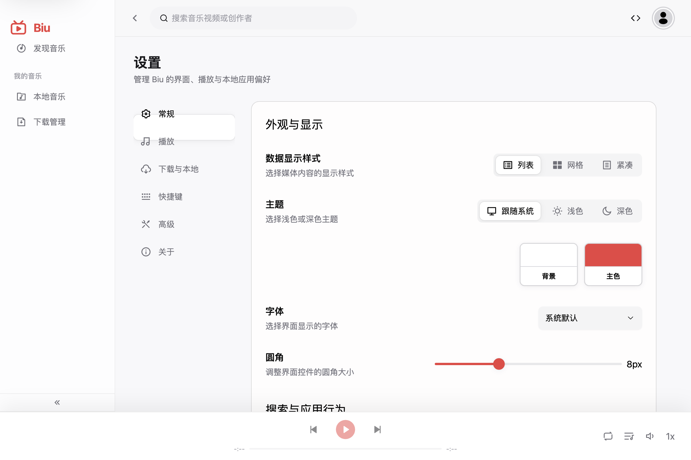
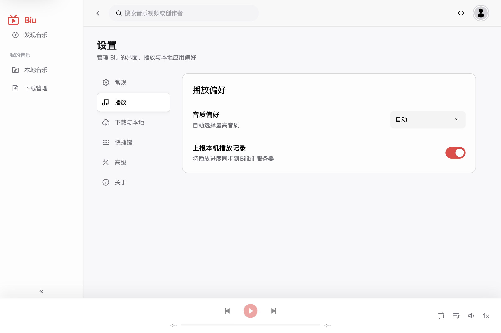
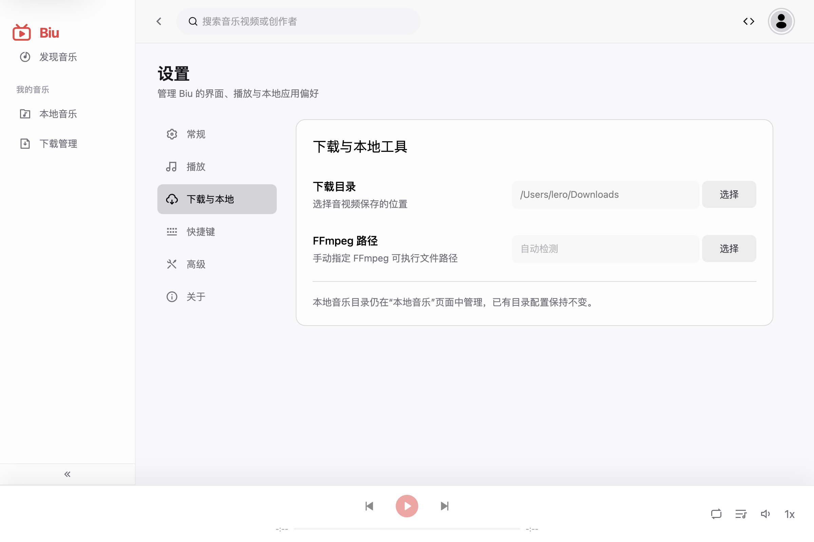
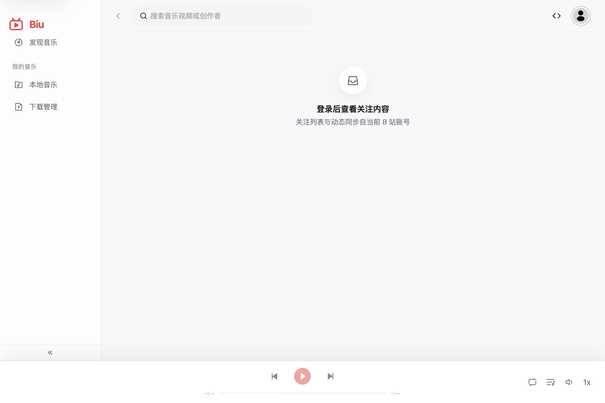

# 阶段 8：关注、创作者与设置验收记录

## 验收范围

- 设置中心六类信息架构与关键分区切换。
- 统一关注页的未登录保护。
- 创作者详情的公开访问状态。
- 播放栏次要操作收拢及开发环境可访问性结构。

## 验收环境

- macOS Electron 开发窗口，1200 × 800 内容区。
- 浅色主题、系统字体、8px 全局圆角。
- B 站账号未登录。
- 通过 Electron 渲染进程截图，避免窗口系统的旧帧缓存影响取证。

## 步骤与结果

### 1. 设置中心常规分类：通过

- 六个分类保持固定纵向位置，页面标题、分类导航和设置内容层级清楚。
- 外观、应用行为和侧边栏显示仍读取原有设置字段。
- 可访问性树包含标题、标签组、组合框、滑块、开关、单选和复选框语义。

### 2. 播放设置：通过

- 音质偏好与播放记录上报独立成组，没有混入下载或系统选项。
- 控件说明与当前状态同时可见。

### 3. 下载与本地设置：通过（已修正）

- 下载目录、FFmpeg 路径及本地目录管理位置说明保持完整。
- 首轮检查发现纵向页签的动画游标可能滞留在上一分类；已关闭该处游标动画并复验，选中背景现与“下载与本地”准确对齐。

### 4. 关注页未登录状态：通过

- 页面明确说明登录要求及数据来源，没有展示失效列表或空白骨架。
- 社交能力未重新进入一级侧栏，符合阶段目标。

### 5. 创作者详情：受外部验证阻塞

- 访问公开创作者时触发 B 站图形验证码，未尝试绕过。
- 验证触发前可访问性树已确认页面具备“音乐内容 / 播放列表 / 动态”栏目、播放全部、搜索、排序和空状态语义。
- 需要在 B 站风控解除或已有有效登录态的环境中补充完整视觉截图。

### 6. 播放栏更多菜单：代码与结构通过，运行截图受播放态限制

- 收藏继续作为常驻操作；点赞、取消点赞、一键三连和“在 B 站打开”已收进更多菜单。
- 未登录状态仅保留来源跳转，登录相关操作按权限隐藏。
- 本轮公开接口风控后无法稳定建立新的在线播放态，因此未将菜单截图列为视觉证据。

## 可访问性与证据限制

- 开发环境已启用 Chromium 完整可访问性树，正式构建行为不受影响。
- 截图能确认层级、可见状态、控件尺寸与对比度风险，但不能证明完整键盘顺序或读屏播报质量。
- 创作者完整数据态、登录后的关注双标签和播放栏登录菜单仍需有效 B 站会话进行补充回归。

## 结论

阶段 8 的信息架构、设置迁移、未登录保护和操作层级符合重构目标。已修复设置纵向页签选中背景错位；其余未完成证据均由 B 站外部验证或会话条件造成，没有发现新的本地功能回归。
