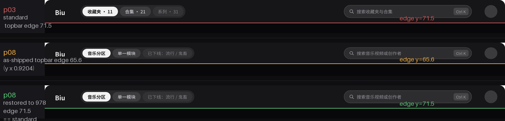
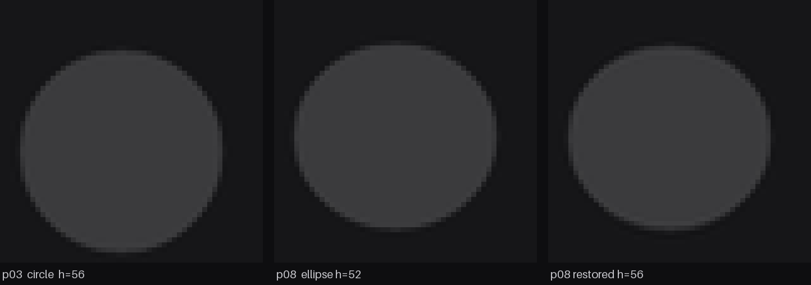
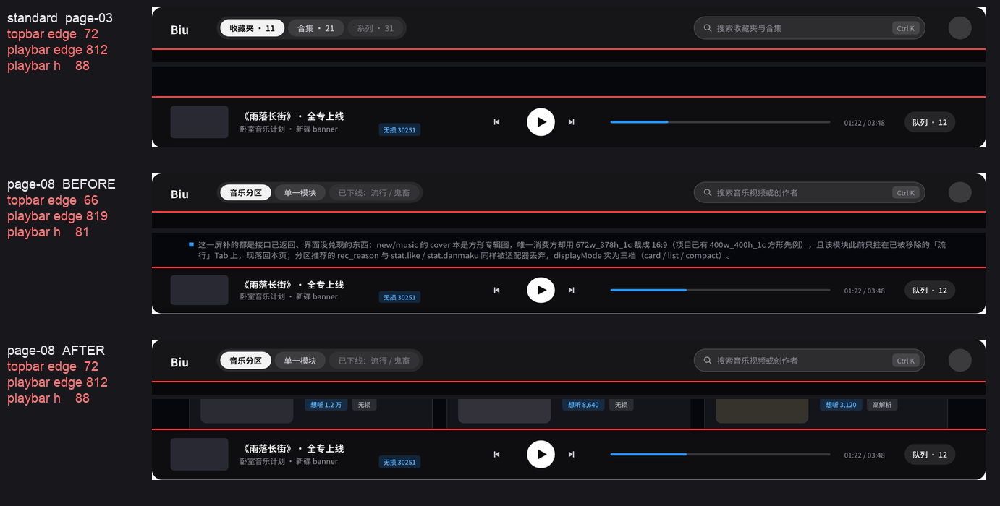

# 参考图第 8 页纵向失真（屏 07 的「壳层不同」结论订正）

**勘定日期**：2026-09-27　**勘定人**：重构施工　**状态**：**已纠正并通过验收**（2026-09-28，spec-lock 1.3.15）

**结论一句话**：屏 07 的参考图 `tools/design-fidelity/reference/page-08.png` **纵向被压缩了 0.9204**，
不是设计稿的壳层差异。此前 `spec-lock` 与 `prototype-baseline` 里记的「该页顶栏 65 / 播放栏 81、
壳层与其余页不同」**是伪影，不是设计意图**。



上图三行分别是「标准页」「第 8 页现状」「第 8 页按第 6 节还原后」，红线标顶栏下缘位置。
第 8 页的壳层明显更薄、内容整体上移；还原后与标准页重合。

---

## 1. 现象

`prototype-baseline.txt`（2026-09-25）第 126–129 行记着屏 07 的两条 L1 失败：

```
===== 07 发现音乐 · 卡片   vs   设计稿第 8 页　[标准壳层] =====
  [L1 硬锚点 · 渲染实测 vs 设计实测]
    FAIL topbarHeight     设计     65  渲染     70  Δ5
    FAIL playbarHeight    设计     81  渲染     88  Δ7
    OK   gutterLeft       设计     64  渲染     64  Δ0
```

注意 `gutterLeft` 是 **Δ0**：横向完全正常，只有纵向两项对不上。这个组合本身就是线索。

## 2. 直接证据：圆形元素被压成椭圆



顶栏右侧的头像是在 12 页中都存在的**固定尺寸圆形**元素。逐页测其包围盒：

| 页 | 02 | 03 | 04 | 05 | 06 | 07 | **08** | 09 | 10 | 11 | 12 | 13 |
| --- | --- | --- | --- | --- | --- | --- | --- | --- | --- | --- | --- | --- |
| 头像 w×h | 26×40 | 26×40 | 26×40 | 26×40 | 26×40 | 26×40 | **26×37** | 26×40 | 26×40 | 26×40 | 26×40 | 26×40 |

**宽一律 26，高只有第 8 页是 37。** 一个圆不会自己变扁 —— 这是纵向压缩的指纹。
按第 6 节的纠正把该页还原到 978 后，头像高度回到 **56**（与标准页一致），
而现状是 52 —— 纠正本身也因此得到一次独立验证。

顶栏搜索框（药丸）同理，用子像素边缘定位其直边中段（x 770–960）：

| 量 | p03（标准页） | p08 | 比 |
| --- | ---: | ---: | ---: |
| 药丸上缘 | 16.87 | 15.60 | 0.925 |
| 药丸下缘 | 54.31 | 49.86 | 0.918 |
| 药丸高 | 37.45 | 34.26 | **0.915** |

## 3. 两处长横边：全 11 页一致到 0.01px，第 8 页例外

用长窗口均值（x 430–470，各窗口交叉验证过）做子像素边缘定位：

| 页 | 顶栏下缘 y | 播放栏上缘 y |
| --- | ---: | ---: |
| 03 / 06 / 07 / 09 / 10 / 04 / 05 | **71.50** | **811.80** |
| **08** | **65.64** | **818.04** |

七个页面完全一致（0.01px 级），第 8 页两项都偏。用三个不同 x 窗口重测顶栏下缘，
第 8 页三次都给出 65.64；播放栏上缘给 818.40 / 818.04 / 817.51（±0.5）。

**注意播放栏是向下偏的**（812 → 818）。这否定了「整页等比压缩」：等比压缩会把底部的
播放栏往上推。播放栏往下走，说明它是**贴着画板底**、随画板一起被压回来的。

## 4. 模型：第 8 页画板高约 978，被强制压回 900

`prepare_reference.sh` 的流程是：`pdftoppm -r 110` 渲染全部页面 → **逐页 `resize((1440, 900))`**。
若某一页的 PDF 页面尺寸与其余页不同，这一步就会**非等比拉伸**它。

设第 8 页画板高为 H（其余页 H = 900）。纵向压缩系数 k = 900/H。

由各**未接触底边**的地标反推 H = 900 · d_std / d_p08：

| 地标 | 标准页 d_std | p08 实测 d_p08 | 反推 H |
| --- | ---: | ---: | ---: |
| 顶栏下缘 | 71.50 | 65.64 | **980.3** |
| 药丸上缘 | 16.87 | 15.60 | **973.0** |
| 药丸下缘 | 54.31 | 49.86 | **980.4** |

三个独立地标收敛到 **H ≈ 978 ± 4**。

用 H = 980.3（k = 0.91837）正向预测三个地标，含贴底的播放栏：

| 地标 | 标准页 | 预测 p08 | 实测 p08 | 残差 |
| --- | ---: | ---: | ---: | ---: |
| 顶栏下缘 | 71.50 | 65.66 | 65.64 | −0.02 |
| 搜索药丸上缘 | 15.00 | 13.78 | 13.50 | −0.28 |
| 搜索药丸下缘 | 56.00 | 51.43 | 51.50 | +0.07 |
| 播放栏上缘 | 811.80 | 819.00 | 818.04 | −0.96 |
| 播放栏高 | 88.18 | 81.0 | 82.0 | +1.0 |

四个地标残差 ≤ 1px。**模型成立：第 8 页画板高约 978，被 `resize((1440,900))` 纵向压回 900。**

同一模型也解释了原型基线里的另两条失败：`lead` 与 `filter` 的带数不一致
（`设计 [[186, 203], [226, 231]]` vs `渲染 [[186, 207]]`）—— 设计侧那两条带也是从被压缩的
参考图上读出来的。

## 5. 影响面

1. **屏 07 的 L1 壳层锚点无法与 1440×900 的渲染直接比对。** `verify.py` 的设计侧读数
   （顶栏 65 / 播放栏 81）带 0.9204 的压缩，渲染侧（71 / 88）是对的 —— 判 FAIL 不是实现的错。
2. **`screens[06].anchors` 的四个纵向值当时都是在压缩后的图上读的**：
   `h1Top 111 / leadTop 186 / filterTop 226 / noteTop 698`。**已于 1.3.15 重测**为
   `H1 121 / 导语 202 / 筛选条 239`（注解带改记画板坐标 841，见第 6 节）。
   顺带发现：其中**筛选条的旧值 226 是被窗口下边界裁出来的伪读数**（默认 filter 窗自 y=226 起，
   压缩图上墨迹起点恰好压线）—— 与 1.3.6「序数度量告诫」同族：**窗口边界与真值边界重合时，读数不可信**。
3. **屏 08（设计页第 9 页）不受影响**：第 9 页实测顶栏 71.50 / 播放栏 811.80 / 头像 26×40，与标准页一致。
4. `spec-lock.screens[06].playbarProgress.reason` 里此前写的「该屏壳层与其余页不同」
   **是错的**，已订正。

## 6. 纠正（已落地 2026-09-28）

比对前把 `page-08.png` 纵向还原，再裁回 1440×900 视口：

1. 载入 `page-08.png`（1440×900），纵向重采样到 1440×978（×1.08667）；
2. 按「顶栏 72 + 内容 740 + 播放栏 88」裁出 1440×900 —— 壳层两端对齐，
   内容取 900 视口能看到的部分（设计画板比视口多出的 78px 内容，与我们的 900 视口无关）。

> 原文写作「顶栏 71 + 内容 741 + 播放栏 88」，合计同为 900，差在「行数」与「首行行号」两种口径。
> 实现按 `standard` 的**第一条低于阈值的行号**（72 / 812）切，两个切点才与其余 11 页逐字对齐。

工具：`tools/design-fidelity/correct_reference.py`

```bash
python tools/design-fidelity/correct_reference.py            # 纠正（幂等，源图读 _source/）
python tools/design-fidelity/correct_reference.py --check    # 只体检，不写盘
python tools/design-fidelity/correct_reference.py --selftest # 回归：生成路径不再压扁画板
```

- 产物 `reference/page-08.png`（1440×900，**参与比对**）；原始失真图留档 `reference/_source/page-08-raw.png`（唯一可追溯来源，**勿删**）。
- 同一个 `fit_canvas()` 已被 `prepare_reference.sh` 复用 —— **从 PDF 重生成不会再压第二次**。
  只修图不改生成器，下次重跑就前功尽弃；`--selftest` 把现有参考图放大回渲染尺寸走一遍生成路径并比对，守住这一点。

### 验收：四个独立地标同时归位

| 地标 | 纠正前 | 纠正后 | 标准页 | 用途 |
| --- | ---: | ---: | ---: | --- |
| 顶栏下缘 | 66 | **72** | 72 | 建模（反推画板高） |
| 播放栏上缘 | 819 | **812** | 812 | 建模 |
| 头像包围盒 | 40×38 | 40×41 | 40×40 | 建模（圆的纵横比） |
| 头部 H1 墨迹 | 111 | **121** | 122 | **独立校验** |
| 播放栏内进度条横带（y=856） | 空 | **[(792, 1172)]** | [(792, 1172)] | **独立校验** |

最后一行最有力：进度条**没有参与反推画板高**，它落在播放栏内部的同一行、同一宽度，与标准页逐像素同值 ——
说明被压的只是外框，该页播放栏的内部布局本就标准。



上图为「标准页 / 第 8 页纠正前 / 第 8 页纠正后」三行，每行上栏是顶栏带、下栏是播放栏带，
红线是实测的壳层边缘：第 8 页纠正前的红线明显内缩（顶栏 66、播放栏 819），纠正后与标准页重合。

### 纠正后对原型实测（屏 07，`--target prototype`）

跑 `bash tools/design-fidelity/run.sh --screen 07-discover-card` 的读数（2026-09-28）：

| 项 | 设计（纠正后） | 原型渲染 | 差 |
| --- | ---: | ---: | ---: |
| 顶栏厚 / 播放栏厚 / 左留白 | 71 / 88 / 64 | 70 / 88 / 64 | Δ1 / Δ0 / Δ0 |
| H1 墨迹 | 121–172 | 111–162 | **+10** |
| 导语 | 202–221 | 186–207 | **+16** |
| 筛选条 | 239–287 | 226–272 | **+13** |
| 播放栏 | 812–899 | 812–899 | 0 |
| 内容带（list / right / note） | — | — | 覆盖率 **0%** |

两件事由此坐实：① **纠正后的设计侧壳层与渲染一致**（Δ0/Δ1），参考图不再是障碍；
② **原型（以及照它实现的屏 07）整个头部与内容都比设计稿高 10–16px** —— 它当初就是对着
那张被压扁的图做的。所以屏 07 不能「沿用原型再微调」，得按纠正后的节奏重排。

### 顺带澄清的两件事（纠正之后才看得见）

1. **本页头部节奏与第 9 页不同**：H1 起点一致（121 / 122），但**导语低 10px、筛选条低 3px**。
   此前这 10px 被压缩与窗口裁切吞掉，读成了取整误差。本页 head 用的是 `head-main--flat` 变体。
2. **设计窗口比本工程高**（978 对 900）：设计页在播放栏之上有 819 行内容，我们只有 741 行，
   多出的 78 行里躺着**本页的注解带**（画板 841–876）。故 `screens[06].anchors.noteTop` 记的是
   画板坐标 841（不在 900 视口的像素里）；实现时注解带按**页流**排在专辑网格之后，首屏不可见。

**为什么不直接改 `resize` 目标**：`prepare_reference.sh` 需要**源 PDF** 才能重跑，而源 PDF
不在仓库内（`meta.sourceRender` 指向 `/tmp/biu-design/`，已失效）。上面的纠正不需要源 PDF；
生成脚本本身也已改成「保宽等比 + 壳层对齐裁切」，将来能拿到 PDF 时走的是同一条路径。

## 7. 防复发

**输出侧**：`verify.py` 的 `reference_integrity()` 逐页测顶栏下缘与播放栏上缘，与标准值比对。
任何页面偏离超过容差、又未在 `spec-lock.referenceIntegrity.declared` 里登记的，**判 FAIL**；
**登记了却不再偏离的也判 FAIL**（提示豁免已过时、应移除）—— 否则 `declared` 会变成永久免检名单。
这道体检跑在渲染之前，抓的是**参考图本身**，可以在不捕获任何渲染的情况下单独跑：

```bash
pnpm verify:reference           # = run.sh --reference-only，已接入 CI
```

**输入侧**：参考图的**生成**路径（`prepare_reference.sh` → `correct_reference.py` 的 `fit_canvas()`）
与 `--selftest` 一起把「逐页强制 resize」这个根因去掉 —— 这次不只修图，也修了会再犯的那一步。

### 一个同族教训：`None` 会把失败伪装成通过

纠正落地后 `_playbar_top_edge` 在第 8 页返回 `None`（栏体正上方是卡片内容，找不到暗行），
而 `reference_integrity` 对 `None` 是**静默跳过**（`v is None` 不计偏离）——
等于这项体检对这一页失效，而且**看起来是全绿的**。已补 `_playbar_top_edge_from_plateau()` 兜底
（改判「栏底平台最长连续段的上缘」，仅在主判据返回 None 时启用，对其余 11 页零影响）。

**凡是「取不到值就返回空」的体检项，都可能把失败伪装成通过。** `None` 必须落进判定，
或显式登记为「本页不适用」。
